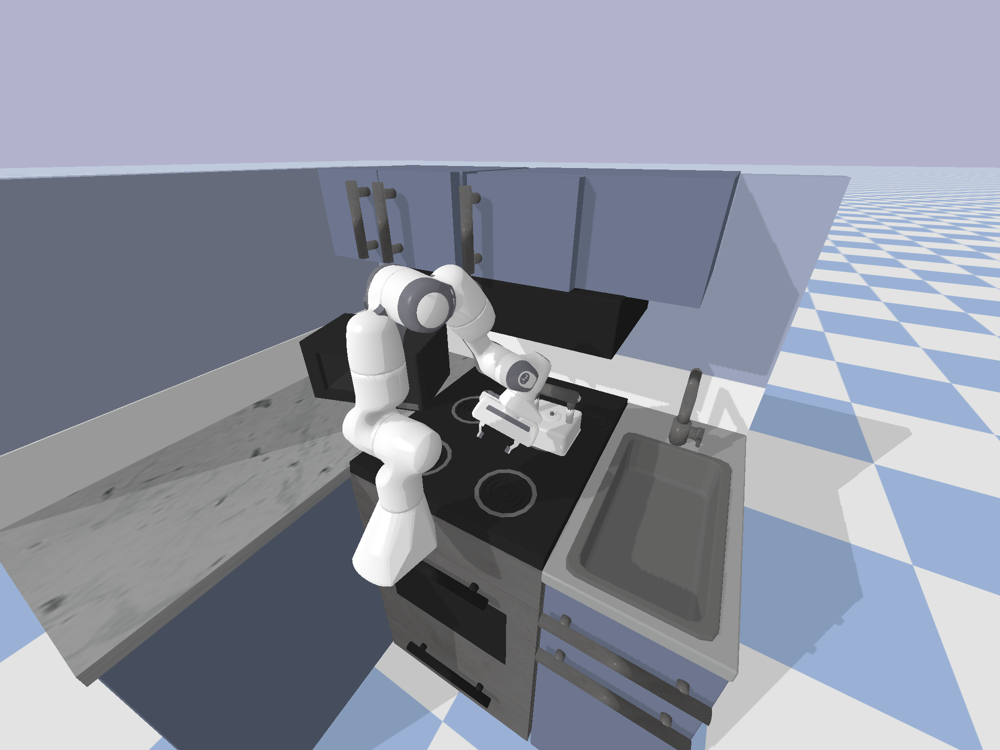

# Franka Kitchen PyBullet

This repository contains code to load and run the [Franka Kitchen](https://robotics.farama.org/envs/franka_kitchen/) environment in PyBullet.



## Running the Code

Clone the repository and run the `main.py` file to load and run the Franka Kitchen simulation environment.

```
git clone https://github.com/kwonathan/franka-kitchen-pybullet.git;
cd franka-kitchen-pybullet;
python main.py
```

## Further Details

### Franka Kitchen

The Franka Kitchen simulation environment was adapted from the MuJoCo XML files available [here](https://github.com/Farama-Foundation/D4RL/tree/master/d4rl/kitchen/adept_models) and [here](https://github.com/google-research/relay-policy-learning/tree/master/adept_models).

The `kitchen_env_model.xml` file was modified from the XML file available [here](https://github.com/Farama-Foundation/D4RL/blob/89141a689b0353b0dac3da5cba60da4b1b16254d/d4rl/kitchen/adept_envs/franka/assets/franka_kitchen_jntpos_act_ab.xml) and [here](https://github.com/google-research/relay-policy-learning/blob/cd70ac9334f584f86db281a1ffd3e5cbc3e5e293/adept_envs/adept_envs/franka/assets/franka_kitchen_jntpos_act_ab.xml). The `kitchen_env_model_modified.xml` file was created by combining the XML files in `item_assets` and `kitchen_env_model.xml`. The `franka_kitchen_desk.urdf` and `franka_kitchen_kettle.urdf` files were created by running the `mjcf2urdf.py` script on `kitchen_env_model_modified.xml`. The URDF files in `item_assets` were created from the `franka_kitchen_desk.urdf` and `franka_kitchen_kettle.urdf` files. Finally, these URDF files were combined into the `kitchen_env_model.urdf` file which can be loaded and run in the PyBullet simulation environment.

### Franka Panda Robot

This repository only contains rudimentary code to load the Franka Kitchen environment, without any capabilities for the robot to move or capture camera images. For more details on implementing these, please refer to [this repository](https://github.com/kwonathan/language-models-trajectory-generators).

### PyBullet

More information on PyBullet can be found [here](https://pybullet.org/wordpress/). The GitHub page can be found [here](https://github.com/bulletphysics/bullet3). A useful quickstart guide can be found [here](https://docs.google.com/document/d/10sXEhzFRSnvFcl3XxNGhnD4N2SedqwdAvK3dsihxVUA/edit?usp=sharing).
